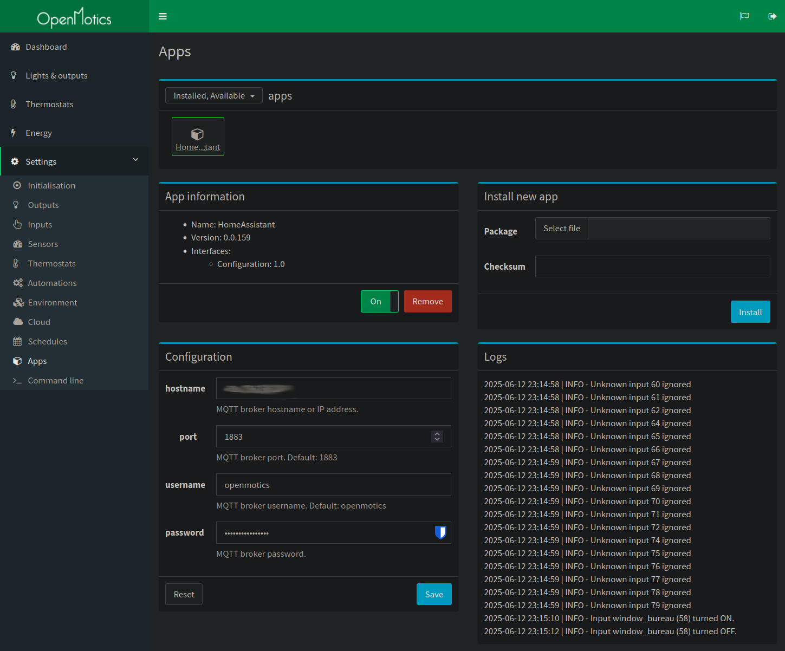

# HomeAssistant

A Home Assistant plugin using MQTT. Control and view Openmotics outputs, sensors and inputs in HomeAssistant, with full autodetection.

## Requirements

- Openmotics installation (mainly developed and tested on gen3 Brain+)
- MQTT broker (eg. Mosquitto)
- Home Assistant installation

## Installation

### Home Assistant

Configure the MQTT integration, point it to your broker.

### Openmotics

Install the app, and point it to your MQTT broker.

